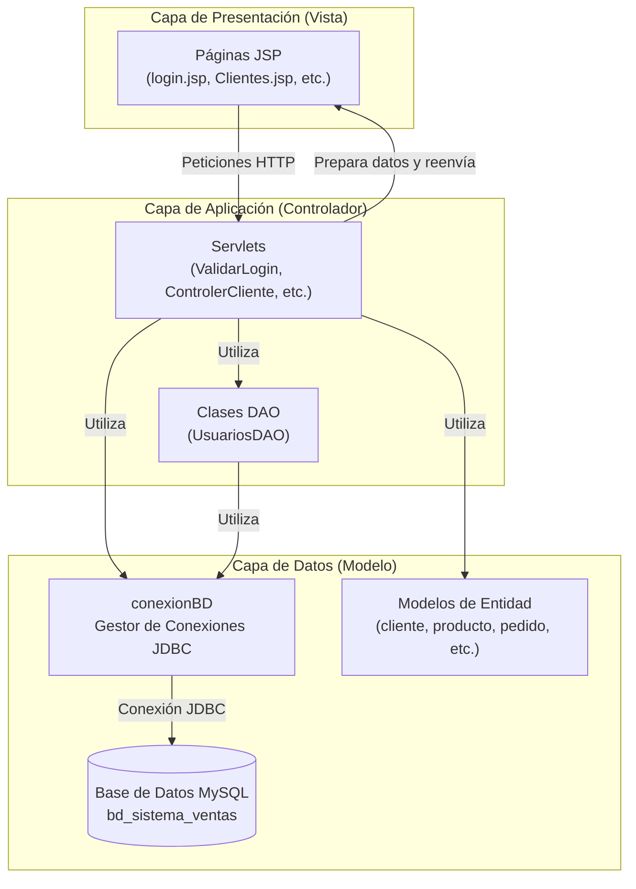

---

# Sistema de Gestión de Pedidos

Este repositorio contiene el código fuente de un **Sistema de Gestión de Pedidos**, una aplicación web empresarial desarrollada con Java EE 7. El sistema está diseñado para digitalizar y optimizar los flujos de trabajo de gestión de pedidos, clientes, productos y usuarios para pequeñas y medianas empresas.

La aplicación sigue una arquitectura MVC tradicional con renderizado del lado del servidor, utilizando Servlets de Java como controladores, páginas JSP para las vistas y JDBC para el acceso directo a la base de datos MySQL.

---

## Índice

- [Características Principales](#características-principales)
- [Arquitectura del Sistema](#arquitectura-del-sistema)
- [Stack Tecnológico](#stack-tecnológico)
- [Guía de Inicio Rápido](#guía-de-inicio-rápido)
  - [Prerrequisitos](#prerrequisitos)
  - [1. Configuración de la Base de Datos](#1-configuración-de-la-base-de-datos)
  - [2. Configuración del Proyecto](#2-configuración-del-proyecto)
  - [3. Compilación](#3-compilación)
  - [4. Despliegue](#4-despliegue)
- [Cómo Usar la Aplicación](#cómo-usar-la-aplicación)
- [Patrones Arquitectónicos Clave](#patrones-arquitectónicos-clave)
- [Contribuciones](#contribuciones)
- [Licencia](#licencia)

---

## Características Principales

- **Gestión de Clientes:** Mantenimiento de un registro de clientes con validación de DNI único.
- **Catálogo de Productos:** Control de inventario con información de costo, precio de venta y cantidad en stock.
- **Procesamiento de Pedidos:** Creación y gestión de pedidos, incluyendo detalles de línea de producto y cálculo automático de impuestos (18% IGV).
- **Administración de Usuarios:** Control de acceso basado en roles con privilegios de administrador y usuario estándar.
- **Seguridad de Sesión Avanzada:** Un sofisticado sistema de autenticación y gestión de sesiones que incluye:
  - Señales *heartbeat* para mantener la sesión activa.
  - Detección de inactividad y cierre de pestaña para finalizar la sesión automáticamente.

## Arquitectura del Sistema

La aplicación implementa una arquitectura clásica de tres capas (MVC), separando claramente la presentación, la lógica de negocio y el acceso a datos.



## Stack Tecnológico

| Componente | Tecnología / Versión | Propósito |
| :--- | :--- | :--- |
| **Lenguaje** | Java 8 | Lenguaje de desarrollo de la aplicación |
| **Plataforma** | Java EE 7 Web Profile | API de Servlets, JSP y JDBC |
| **Servidor de Aplicaciones** | Apache Tomcat | Contenedor de servlets y servidor web |
| **Base de Datos** | MySQL | Sistema de gestión de base deatos relacional |
| **Driver JDBC** | MySQL Connector/J | Conectividad con la base de datos |
| **Sistema de Compilación** | Apache Ant | Automatización de la compilación y empaquetado |
| **IDE (Entorno de Desarrollo)**| Apache NetBeans | Proyecto configurado para este IDE |

---

## Guía de Inicio Rápido

Sigue estos pasos para configurar, compilar y desplegar el proyecto en un entorno local.

### Prerrequisitos

- **JDK 8** (Java Development Kit 1.8).
- **Apache Ant** (versión 1.7.1 o superior).
- **Apache Tomcat** (compatible con Java EE 7, ej. Tomcat 8.x o 9.x).
- Un servidor de **MySQL**.

### 1. Configuración de la Base de Datos

El sistema no utiliza migraciones automáticas. Debes crear la base de datos y las tablas manualmente.

1.  **Crea la base de datos:**
    ```sql
    CREATE DATABASE bd_sistema_ventas;
    USE bd_sistema_ventas;
    ```
2.  **Crea las tablas:** Utiliza el siguiente diagrama como referencia para crear las tablas `t_cliente`, `t_producto`, `t_pedido`, `t_detalle_pedido` y `t_usuario`.

    ```mermaid
    erDiagram
        t_cliente ||--o{ t_pedido : "realiza"
        t_pedido ||--|{ t_detalle_pedido : "contiene"
        t_producto ||--o{ t_detalle_pedido : "incluido en"
        
        t_cliente {
            string Id_Cliente PK
            string Apellidos
            string Nombres
            string DNI UK
        }
        
        t_producto {
            string Id_Prod PK
            string Descripcion
            double precio
            int cantidad
        }
        
        t_pedido {
            string Id_Pedido PK
            string Id_Cliente FK
            date Fecha
            double TotalVenta
            string Estado
        }
        
        t_detalle_pedido {
            string Id_Pedido FK
            string Id_Prod FK
            double Cantidad
            double Precio
        }
        
        t_usuario {
            string IdUsuario PK
            string Passwd
            int esAdmin
        }
    ```

3.  **Crea un usuario administrador inicial:** Para poder iniciar sesión, inserta al menos un usuario con privilegios de administrador.
    ```sql
    INSERT INTO t_usuario (IdUsuario, Passwd, esAdmin, Estado, FechaRegistro) 
    VALUES ('admin', 'admin', 1, 'Activo', NOW());
    ```

### 2. Configuración del Proyecto

1.  **Clona el repositorio:**
    ```bash
    git clone https://github.com/OAQR/SistemaGestionDePedidos.git
    cd SistemaGestionDePedidos
    ```
2.  **Configura la conexión a la base de datos:**
    Los credenciales de la base de datos están **hardcodeados** en el código. Modifica el archivo `src/java/conexion/conexionBD.java` para que apunte a tu base de datos local.

    ```java
    // src/java/conexion/conexionBD.java
    
    // Cambia estos valores por los de tu configuración local
    static String host = "localhost";
    static String port = "3306";
    static String database = "bd_sistema_ventas";
    static String user = "root";  // Tu usuario de MySQL
    static String pass = "tu_contraseña"; // Tu contraseña de MySQL
    ```

### 3. Compilación

El proyecto utiliza Apache Ant para la compilación. Desde la raíz del proyecto, ejecuta:

1.  **Limpiar compilaciones anteriores (opcional pero recomendado):**
    ```bash
    ant clean
    ```
2.  **Compilar y empaquetar la aplicación:**
    ```bash
    ant dist
    ```
    Este comando generará un archivo `.war` en el directorio `dist/`, llamado `PractSem04.war`.

### 4. Despliegue

1.  Asegúrate de que tu servidor Apache Tomcat esté en ejecución.
2.  Copia el archivo `dist/PractSem04.war` al directorio `webapps` de tu instalación de Tomcat.
    -   En Windows: `C:\path\to\tomcat\webapps\`
    -   En Linux: `/opt/tomcat/webapps/`
3.  Tomcat desplegará automáticamente la aplicación.

---

## Cómo Usar la Aplicación

1.  **Accede a la aplicación:**
    Abre tu navegador y ve a `http://localhost:8080/`. El proyecto está configurado para desplegarse en el contexto raíz.

2.  **Inicio de sesión:**
    Serás redirigido a la página de login. Usa las credenciales del usuario administrador que creaste en el paso de configuración de la base de datos (ej. `admin` / `admin`).

3.  **Navegación:**
    Una vez dentro, podrás acceder a los diferentes módulos del sistema: Clientes, Productos, Pedidos y (como administrador) Usuarios.

---

## Patrones Arquitectónicos Clave

El sistema hace uso de varios patrones de diseño consistentes a lo largo del código:

- **Patrón de Comando:** Los servlets utilizan un parámetro `Op` en la URL (`?Op=Listar`) para enrutar las peticiones a la operación CRUD correspondiente.
- **Post-Redirect-Get (PRG):** Todas las operaciones que modifican datos (POST) finalizan con una redirección a una página de visualización (GET), evitando envíos duplicados de formularios.
- **Generación de IDs Secuenciales:** Los IDs para clientes (`C00001`), productos (`P00001`) y pedidos (`P0001`) se generan en la capa de aplicación, consultando el último ID existente en la base de datos.
- **Heartbeat de Sesión del Lado del Cliente:** Un script de JavaScript monitorea la actividad del usuario y envía señales periódicas al servidor para evitar que la sesión expire prematuramente.

---

## Contribuciones

Este es un proyecto de portafolio personal y actualmente no se aceptan contribuciones externas. Sin embargo, si encuentras algún error o tienes alguna sugerencia, no dudes en abrir un *Issue* en el repositorio.

---

## Licencia

Este proyecto está bajo la Licencia MIT. Consulta el archivo `LICENSE` para más detalles.


